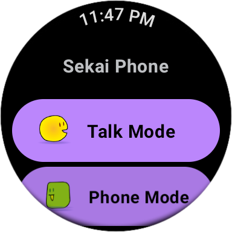

author: Kenichi Kambara
summary: Wear OS Codelab
id: codelab-wearos-markdown
categories: codelab,markdown
environments: Wearable
status: Published
feedback link: https://github.com/korodroid/hoge
analytics account:

# Building for WearOS Apps Codelab

## Introduction
Duration: 0:05:00

This Codelab explains how to develop WearOS Apps with Jetpack Compose.

"Compose for Wear OS" simplifies and accelerates UI development and helps you create beautiful apps with less code. Currently, it's the most recommended approach for Wear OS Apps Development.

For this codelab, we expect that you have some knowledge of Compose and Kotlin, but you certainly don't need to be an expert.

At this codelab, it starts from the basic sample. And you will learn how to improve Wear OS apps with Jetpack Compose little by little. Finally, you can start writing your own apps for Wear OS. Let's get started!

### Wear OS Apps Examples




### What you will learn

- How to get started Wear OS Apps Development with Jetpack Compose
- Similarities/differences between Mobile and WearOS experience with Jetpack Compose
- Basic Wear OS composables
- How to optimize screens for Wear OS
- How to get improve Wear OS UI & UX with useful composables


### What you will build

At first, you'll build a simple app that displays just a scrollable list of composables. It's just like a simple Contacts App. But there are some problems. Screens aren't opzimized for Wear OS. It includes only one screen. Also, it doesn't include any navigations.

Here are some steps for improving UI & UX.

By modifing the code little by little, finally you'll find how we develop the Wear OS screens.

Because you will be using Scaffold, you'll also get a curved text time at the top, a vignette, and finally a scrolling indicator tied to the side of the device.

Here's what it will look like when you are finished with the code lab:


## Getting Set Up (in advance)

### What you will need

- Android Studio
	- Mandatory: Dolphin, Electric Eel or Flamingo
	- Recommended (On this workshop): Electric Eel
- Wear OS AVD images
	- Recommended: API Level 30

### How to prepare Wear OS AVD


### Download code

If you have git installed, you can simply run the command below to clone the code from [this repo](https://github.com/korodroid/WearOSComposeCodelab). To check whether git is installed, type ``git --version`` in the terminal or command line and verify that it executes correctly.

```
git clone https://github.com/korodroid/WearOSComposeCodelab.git
cd WearOSComposeCodelab
```

If you do not have git, you can click the following button to download all the code for this codelab:

<button>
[Download ZIP](https://github.com/korodroid/WearOSComposeCodelab/archive/refs/heads/main.zip)
</button>


## Run the Base App
Duration: 0:10:00

### Open project in Android Studio

1. On the Welcome to Android Studio window select  Open an Existing Project
2. Select the folder ``[Download Location]``
3. When Android Studio has imported the project, test that you can run the ``start`` and ``finished`` modules on a Wear OS emulator or physical device.
4. The ``start`` module should look like the screenshot below. It's where you will be doing all your work.


### Explore the start code

- **build.gradle** contains a basic app configuration. It includes the dependencies necessary to create a Composable Wear OS App. We'll discuss what's similar and different between Jetpack Compose and the Wear OS version.
- **main > AndroidManifest.xml** includes the elements necessary to create a Wear OS application. This is the same as a non-Compose app and similar to a mobile app, so we won't review this.
- **main > theme/** folder contains the Color, Type, and Theme files used by Compose for the theme.
- **main > MainActivity.kt** contains boilerplate for creating an app with Compose. It also contains the top-level composables (like the Scaffold and ScalingLazyList) for our app.

### Result

Positive
: You can also refer an answer (`start` module)


## Step1
Duration: 0:10:00

TBD (In a short word, ``Replacing to ScalingLazyColumn``)

### Result

Positive
: You can also refer an answer (`step1` module)


## Step2
Duration: 0:10:00

TBD (In a short word, ``Using Scaffold``)

### Result

Positive
: You can also refer an answer (`step2` module)


## Step3
Duration: 0:10:00

### What we'd like to develop


TBD (In a short word, ``Adding a new Screen``)

### Result

Positive
: You can also refer an answer (`step3` module)


## Step4
Duration: 0:10:00

TBD (In a short word, ``Implementing Navigation ``)

### Result

Positive
: You can also refer an answer (`step4` module)


## Step5
Duration: 0:10:00

TBD (In a short word, ``Replacing to Wear Navigation``)

### Result

Positive
: You can also refer an answer (`finished` module)

